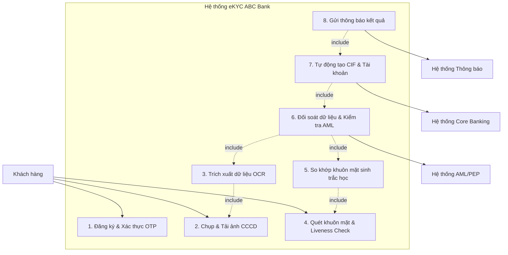
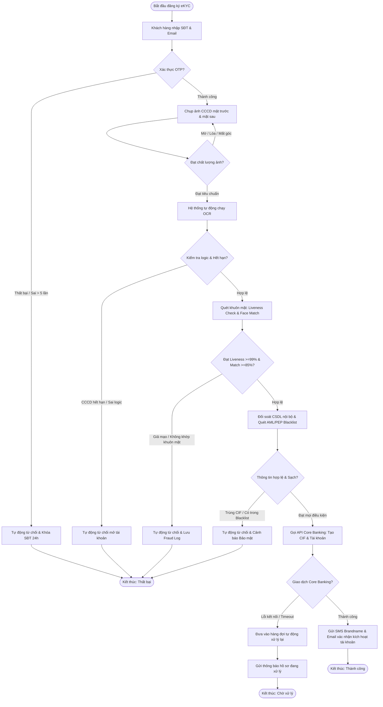

# TÀI LIỆU ĐẶC TẢ YÊU CẦU PHẦN MỀM (SRS)
## HỆ THỐNG MỞ TÀI KHOẢN TRỰC TUYẾN QUA eKYC - ABC BANK
*(Tài liệu đặc tả nghiệp vụ & kỹ thuật theo chuẩn IEEE 830)*

---

## PHẦN 1. INTRODUCTION (GIỚI THIỆU)

### 1.1. Purpose (Mục đích tài liệu)
Tài liệu Đặc tả Yêu cầu Phần mềm (Software Requirements Specification - SRS) này xác định chi tiết các yêu cầu chức năng, phi chức năng, quy tắc nghiệp vụ và sơ đồ thiết kế cho **Hệ thống Mở tài khoản trực tuyến qua định danh điện tử (eKYC)** của **ABC Bank**.
Tài liệu này được biên soạn nhằm:
* Làm cơ sở thống nhất yêu cầu nghiệp vụ giữa bộ phận Phát triển Sản phẩm (Product), Vận hành (Operations), Quản trị rủi ro (Risk Management) và Đội ngũ kỹ thuật.
* Cung cấp các thông tin đặc tả chính xác cho Đội ngũ Lập trình (Developers) thiết kế kiến trúc hệ thống và xây dựng mã nguồn.
* Làm căn cứ cho Đội ngũ Kiểm thử (QA/QC) xây dựng kịch bản kiểm thử (Test Cases) nhằm nghiệm thu chất lượng phần mềm.
* Đảm bảo tính tuân thủ pháp lý theo các quy định hiện hành của Ngân hàng Nhà nước Việt Nam (NHNN).

### 1.2. Scope (Phạm vi hệ thống)
Hệ thống eKYC của ABC Bank là một phân hệ dịch vụ tích hợp trên ứng dụng Mobile Banking (iOS & Android). Hệ thống thực hiện quy trình tự động hóa hoàn toàn theo cơ chế **Straight-Through Processing (STP) - Zero Manual Operation** nhằm mở tài khoản thanh toán cho khách hàng cá nhân.
* **Phạm vi bao gồm:**
  * Tiếp nhận thông tin đăng ký ban đầu (Số điện thoại, Email) và xác thực qua OTP.
  * Hướng dẫn khách hàng chụp ảnh Căn cước công dân (CCCD) mặt trước và mặt sau trực tiếp qua camera ứng dụng.
  * Tự động trích xuất thông tin từ ảnh chụp CCCD bằng công nghệ nhận dạng ký tự quang học (OCR).
  * Xác thực khuôn mặt của khách hàng qua sinh trắc học (Face Matching) đối chiếu với ảnh trên CCCD.
  * Kiểm tra thực thể sống (Liveness Check) để ngăn ngừa các hành vi gian lận (deepfake, phát lại video, mặt nạ, ảnh in).
  * Tự động đối soát thông tin khách hàng với cơ sở dữ liệu nội bộ (tránh trùng lặp tài khoản) và sàng lọc danh sách đen phòng chống rửa tiền (AML/PEP Blacklist).
  * Tự động gọi API khởi tạo mã Khách hàng (CIF) và mở Tài khoản thanh toán trên hệ thống Core Banking.
  * Tự động gửi thông báo kết quả mở tài khoản kèm thông tin đăng nhập dịch vụ qua SMS Brandname và Email cho khách hàng.
* **Phạm vi không bao gồm:**
  * Quy trình phê duyệt thủ công (Manual Approval) bởi giao dịch viên ngân hàng (đáp ứng mục tiêu Zero Manual Operation). Các hồ sơ không đạt điều kiện kiểm tra tự động sẽ bị hệ thống từ chối ngay lập tức và hướng dẫn khách hàng ra quầy giao dịch vật lý.
  * Quy trình phát hành thẻ vật lý tại quầy (quy trình này sẽ được xử lý riêng sau khi tài khoản trực tuyến đã được kích hoạt thành công).

### 1.3. Definitions (Định nghĩa)
* **Khách hàng (Customer):** Cá nhân có nhu cầu mở tài khoản thanh toán tại ABC Bank và thực hiện quy trình đăng ký trực tiếp trên ứng dụng di động.
* **Straight-Through Processing (STP):** Quy trình xử lý tự động xuyên suốt từ đầu đến cuối mà không cần bất kỳ sự can thiệp thủ công nào của con người.
* **Liveness Check:** Công nghệ xác thực sinh trắc học nhằm xác định xem dữ liệu khuôn mặt thu thập được là từ người thật đang thực hiện tương tác trực tiếp, chứ không phải hình ảnh hoặc video giả mạo.
* **Face Matching:** Quá trình so sánh đặc điểm sinh trắc học giữa hai hình ảnh khuôn mặt để tính toán độ tương đồng và đưa ra kết luận có phải là cùng một người hay không.
* **Session Token:** Chuỗi mã hóa ngắn hạn được sinh ra sau khi xác thực OTP thành công để định danh và bảo mật cho toàn bộ tiến trình eKYC tiếp theo của phiên giao dịch đó.

### 1.4. Acronyms (Các từ viết tắt)
| Từ viết tắt | Thuật ngữ đầy đủ | Định nghĩa tiếng Việt |
| :--- | :--- | :--- |
| **eKYC** | Electronic Know Your Customer | Định danh khách hàng điện tử |
| **OCR** | Optical Character Recognition | Nhận dạng ký tự quang học |
| **CCCD** | Citizen Identity Card | Căn cước công dân |
| **API** | Application Programming Interface | Giao diện lập trình ứng dụng |
| **AML** | Anti-Money Laundering | Phòng chống rửa tiền |
| **PEP** | Politically Exposed Persons | Cá nhân có ảnh hưởng chính trị |
| **OTP** | One-Time Password | Mật khẩu sử dụng một lần |
| **CIF** | Customer Information File | Tệp thông tin khách hàng (Mã định danh duy nhất trên Core Banking) |
| **SDK** | Software Development Kit | Bộ công cụ phát triển phần mềm |
| **STP** | Straight-Through Processing | Xử lý tự động xuyên suốt |
| **NHNN / SBV** | State Bank of Vietnam | Ngân hàng Nhà nước Việt Nam |
| **PII** | Personally Identifiable Information | Thông tin định danh cá nhân |
| **TPS** | Transactions Per Second | Số lượng giao dịch xử lý trong một giây |

### 1.5. References (Tài liệu tham khảo)
1. *IEEE Std 830-1998*, IEEE Recommended Practice for Software Requirements Specifications.
2. *Thông tư số 16/2020/TT-NHNN* ngày 04/12/2020 của Ngân hàng Nhà nước Việt Nam hướng dẫn việc mở và sử dụng tài khoản thanh toán tại tổ chức cung ứng dịch vụ thanh toán.
3. *Nghị định 13/2023/NĐ-CP* ngày 17/04/2023 của Chính phủ Việt Nam về Bảo vệ dữ liệu cá nhân (PDPD).
4. Quy định bảo mật và tiêu chuẩn kỹ thuật an toàn thông tin nội bộ của Ngân hàng ABC Bank.

---

## PHẦN 2. OVERALL DESCRIPTION (MÔ TẢ TỔNG QUAN)

### 2.1. Product Perspective (Bối cảnh sản phẩm)
Phân hệ eKYC hoạt động như một dịch vụ lõi trung tâm trong kiến trúc Microservices của hệ thống Ngân hàng số ABC Bank. Hệ thống tương tác trực tiếp với các thành phần ứng dụng và dịch vụ ngoại vi theo mô hình dưới đây:
* **Mobile Client (iOS/Android App):** Cung cấp giao diện tương tác người dùng, tích hợp SDK Camera để chụp ảnh giấy tờ và quét khuôn mặt thời gian thực.
* **eKYC Backend Gateway:** Nhận yêu cầu từ Mobile Client, kiểm soát phiên giao dịch (Session Management), điều phối luồng nghiệp vụ và mã hóa dữ liệu.
* **OCR Engine Service:** Dịch vụ phân tích ảnh giấy tờ tùy thân và trích xuất thông tin dạng văn bản thô kèm điểm số tin cậy.
* **Face Matching & Liveness Engine:** Dịch vụ phân tích sinh trắc học để xác thực thực thể sống và so khớp khuôn mặt người thực với ảnh trên giấy tờ.
* **Hệ thống AML/PEP Database:** Cơ sở dữ liệu danh sách đen, danh sách cấm vận và cá nhân có ảnh hưởng chính trị để kiểm tra điều kiện phòng chống rửa tiền.
* **Hệ thống Core Banking:** Hệ thống ngân hàng lõi đảm nhận việc khởi tạo hồ sơ thông tin khách hàng (Mã CIF) và tạo số tài khoản thanh toán.
* **Notification System:** Dịch vụ gửi tin nhắn SMS Brandname và Email xác nhận giao dịch tự động.

### 2.2. Product Functions (Các chức năng chính của sản phẩm)
Hệ thống eKYC cung cấp 8 nhóm chức năng cốt lõi được thực hiện tuần tự và hoàn toàn tự động:
1. **Đăng ký tài khoản & Xác thực OTP:** Tiếp nhận thông tin liên lạc ban đầu và gửi mã OTP xác nhận tính chính hữu của số điện thoại và email.
2. **Tải ảnh CCCD (Mặt trước/Mặt sau):** Thu thập ảnh chụp trực tiếp giấy tờ tùy thân của khách hàng thông qua camera được kiểm soát chất lượng bằng SDK.
3. **Trích xuất thông tin OCR:** Tự động chuyển đổi thông tin dạng hình ảnh trên CCCD thành dữ liệu số có cấu trúc phục vụ lưu trữ và đối soát.
4. **Xác thực khuôn mặt (Face Matching):** So sánh đặc điểm sinh trắc học khuôn mặt selfie của khách hàng với ảnh chân dung in trên thẻ CCCD.
5. **Kiểm tra thực thể sống (Liveness Check):** Kiểm tra xem khách hàng có phải là người thật đang thao tác trực tiếp trước camera hay không.
6. **Kiểm tra tính hợp lệ dữ liệu:** Đối soát độ tuổi của khách hàng, kiểm tra trùng lặp thông tin CCCD trong cơ sở dữ liệu ngân hàng và quét danh sách cấm AML/PEP.
7. **Tự động mở tài khoản:** Khởi tạo CIF và số tài khoản thanh toán trên hệ thống Core Banking theo mô hình xử lý xuyên suốt (STP).
8. **Gửi thông báo:** Gửi SMS Brandname chứa thông tin kích hoạt tài khoản và Email chứa thông tin tài khoản kèm điều khoản sử dụng cho khách hàng.

### 2.3. User Classes and Characteristics (Phân loại và đặc điểm người dùng)
* **Khách hàng cá nhân (End Users):**
  * Là mọi công dân Việt Nam đủ năng lực hành vi dân sự, sở hữu điện thoại thông minh chạy hệ điều hành iOS/Android và có kết nối mạng Internet.
  * Đặc điểm: Trình độ công nghệ ở mức cơ bản, yêu cầu giao diện đơn giản, hướng dẫn rõ ràng từng bước, thời gian xử lý nhanh chóng dưới 1 phút.
* **Quản trị viên Hệ thống (System Administrators):**
  * Là nhân viên thuộc phòng Vận hành công nghệ của ABC Bank.
  * Đặc điểm: Có kiến thức chuyên môn kỹ thuật cao. Nhiệm vụ chính là giám sát hoạt động hệ thống qua Dashboard, cấu hình các tham số vận hành (như ngưỡng khớp khuôn mặt, thời gian sống của OTP, bật/tắt các bước bảo mật bổ sung), kiểm tra log lỗi khi có sự cố kỹ thuật. Không có quyền can thiệp phê duyệt hồ sơ khách hàng.

### 2.4. Operating Environment (Môi trường vận hành)
* **Môi trường phía Client:**
  * Hệ điều hành iOS: Phiên bản 14.0 trở lên.
  * Hệ điều hành Android: Phiên bản 9.0 trở lên.
  * Thiết bị yêu cầu tích hợp camera trước và camera sau hoạt động bình thường, độ phân giải tối thiểu 5 Megapixels.
* **Môi trường phía Server:**
  * Kiến trúc Microservices chạy trên nền tảng container hóa (Kubernetes) được triển khai trên hạ tầng Private Cloud của ABC Bank để đảm bảo an toàn thông tin tối đa.
  * Cơ sở dữ liệu: PostgreSQL lưu trữ thông tin cấu trúc; Redis lưu trữ dữ liệu phiên giao dịch ngắn hạn (Session/OTP).
  * Tích hợp mạng an toàn nội bộ kết nối trực tiếp với hệ thống Core Banking qua VPN/Direct Connect bảo mật.

### 2.5. Design and Implementation Constraints (Các ràng buộc thiết kế và triển khai)
* **Ràng buộc bảo mật:** Tuân thủ tiêu chuẩn bảo mật OWASP Mobile Top 10. Toàn bộ dữ liệu truyền tải giữa Client và Server phải sử dụng giao thức HTTPS với mã hóa TLS 1.3. Dữ liệu lưu trữ phải được mã hóa bằng thuật toán AES-256.
* **Ràng buộc hiệu năng:** Hệ thống phải phản hồi kết quả OCR và xác thực khuôn mặt trong thời gian dưới 3 giây. Tổng thời gian xử lý một luồng eKYC hoàn chỉnh không quá 60 giây.
* **Ràng buộc pháp lý:** Tuân thủ Thông tư 16/2020/TT-NHNN của Ngân hàng Nhà nước về mở tài khoản thanh toán bằng phương thức điện tử và Nghị định 13/2023/NĐ-CP về Bảo vệ dữ liệu cá nhân.
* **Ràng buộc tích hợp:** Hệ thống bắt buộc phải tích hợp đồng bộ với hệ thống Core Banking hiện tại của ABC Bank thông qua các API chuẩn hóa (RESTful JSON/gRPC), đảm bảo tính nguyên tử của giao dịch mở tài khoản.

### 2.6. Assumptions and Dependencies (Các giả định và phụ thuộc)
* **Giả định:** Khách hàng thao tác trong môi trường đủ ánh sáng, không có tiếng ồn quá lớn làm gián đoạn kiểm tra Liveness bằng giọng nói (nếu có), camera không bị mờ bẩn hoặc che khuất.
* **Phụ thuộc:**
  * Sự ổn định của các dịch vụ OCR Engine và Sinh trắc học bên thứ ba (cam kết SLA thời gian hoạt động tối thiểu 99.9%).
  * Sự ổn định của mạng viễn thông (SMS Gateway) để gửi tin nhắn OTP và thông báo tài khoản cho khách hàng.
  * Hệ thống Core Banking của ABC Bank không bị gián đoạn hoạt động trong quá trình eKYC diễn ra.

---

## PHẦN 3. SPECIFIC FUNCTIONAL REQUIREMENTS (YÊU CẦU CHỨC NĂNG CHI TIẾT)

### 3.1. Đăng ký thông tin ban đầu & Xác thực OTP (REQ-001)
* **Requirement ID:** REQ-001
* **Tên chức năng:** Đăng ký thông tin ban đầu & Xác thực OTP
* **Mô tả:** Tiếp nhận thông tin số điện thoại, email đăng ký của khách hàng và thực hiện xác thực thông qua mã OTP nhằm xác nhận tính sở hữu hợp pháp đối với kênh liên lạc này.
* **Đầu vào:**
  * Số điện thoại khách hàng (độ dài 10 chữ số).
  * Email khách hàng (định dạng RFC 5322 hợp lệ).
* **Đầu ra:**
  * Mã OTP được gửi tới số điện thoại/email khách hàng.
  * Phiên giao dịch (Session ID) được khởi tạo thành công trên hệ thống.
* **Quy tắc nghiệp vụ (Business Rules):**
  * Số điện thoại đăng ký chưa từng tồn tại trên hệ thống ABC Bank ở trạng thái hoạt động (Active).
  * Mã OTP là chuỗi số ngẫu nhiên gồm 6 chữ số.
  * Thời gian hiệu lực của mã OTP (TTL) là 120 giây (2 phút).
  * Khách hàng được yêu cầu gửi lại OTP tối đa 3 lần trong một phiên giao dịch.
  * Nếu khách hàng nhập sai mã OTP liên tiếp 5 lần, số điện thoại đăng ký sẽ bị khóa trên hệ thống trong vòng 24 giờ.
* **Luồng xử lý (Flow of Events):**
  * **Luồng chính (Main Flow):**
    1. Khách hàng nhập Số điện thoại và Email trên màn hình đăng ký của ứng dụng di động.
    2. Khách hàng nhấn nút "Tiếp tục".
    3. Hệ thống kiểm tra định dạng Số điện thoại và Email.
    4. Hệ thống kiểm tra trùng lặp Số điện thoại trong cơ sở dữ liệu ABC Bank.
    5. Hệ thống sinh mã OTP ngẫu nhiên, lưu trữ vào Redis cache với khóa là Số điện thoại và thời gian hết hạn là 120 giây.
    6. Hệ thống gửi mã OTP qua SMS Brandname tới số điện thoại và qua Email tới hòm thư của khách hàng.
    7. Ứng dụng di động hiển thị màn hình nhập OTP kèm đồng hồ đếm ngược 120 giây.
    8. Khách hàng nhận được mã OTP, thực hiện nhập vào ứng dụng.
    9. Hệ thống đối khớp mã OTP khách hàng nhập với mã OTP lưu trong Redis.
    10. Hệ thống xác nhận mã OTP hợp lệ, khởi tạo Session ID và trả về mã thông báo thành công cho Client để chuyển sang màn hình tiếp theo.
  * **Luồng thay thế (Alternative Flow - Gửi lại OTP):**
    * Tại bước 7, sau khi hết 120 giây đếm ngược, khách hàng nhấn nút "Gửi lại OTP". Hệ thống tiến hành hủy mã OTP cũ, sinh mã OTP mới và thực hiện lại từ bước 5 (tối đa 3 lần).
  * **Luồng lỗi (Exception Flows):**
    * *Số điện thoại đã tồn tại:* Hệ thống thông báo lỗi "Số điện thoại đã được đăng ký tài khoản tại ABC Bank. Vui lòng đăng nhập hoặc sử dụng số điện thoại khác".
    * *Nhập sai OTP:* Hệ thống báo lỗi "Mã OTP không chính xác. Quý khách còn X lần thử lại" (với X giảm dần từ 5 về 0).
    * *Vượt quá số lần thử OTP:* Hệ thống ghi nhận trạng thái khóa số điện thoại trong 24 giờ, thông báo lỗi "Tài khoản đăng ký tạm thời bị khóa do nhập sai OTP quá 5 lần. Vui lòng quay lại sau 24 giờ".
* **Điều kiện lỗi:**
  * Lỗi kết nối SMS Gateway (không gửi được tin nhắn OTP).
  * Khách hàng không nhận được OTP do thuê bao ngoài vùng phủ sóng.

### 3.2. Chụp và Tải ảnh CCCD (REQ-002)
* **Requirement ID:** REQ-002
* **Tên chức năng:** Chụp và Tải ảnh CCCD (Mặt trước & Mặt sau)
* **Mô tả:** Ứng dụng mở camera và hướng dẫn khách hàng chụp trực tiếp ảnh mặt trước và mặt sau của CCCD để làm căn cứ trích xuất thông tin và xác thực sinh trắc học.
* **Đầu vào:**
  * Luồng camera thời gian thực (Camera Live Stream).
  * File ảnh mặt trước CCCD.
  * File ảnh mặt sau CCCD.
* **Đầu ra:**
  * 02 file ảnh (mặt trước và mặt sau CCCD) được tối ưu hóa chất lượng, mã hóa và lưu trữ tạm thời trong thư mục phiên giao dịch của server eKYC.
* **Quy tắc nghiệp vụ (Business Rules):**
  * Ảnh CCCD phải được chụp trực tiếp từ camera trong ứng dụng. Hệ thống chặn hoàn toàn tính năng chọn ảnh có sẵn từ thư viện thiết bị (Gallery) hoặc ảnh chụp lại từ màn hình khác để tránh gian lận.
  * Ảnh chụp phải đáp ứng tiêu chuẩn kỹ thuật kiểm tra tự động của SDK:
    * Không bị lóa sáng bởi ánh đèn hoặc ánh mặt trời.
    * Không bị mờ (out of focus), không bị rung tay.
    * Không bị mất góc, mất viền thẻ CCCD.
    * Đầy đủ thông tin chữ viết và ảnh chân dung rõ nét trên thẻ.
* **Luồng xử lý (Flow of Events):**
  * **Luồng chính (Main Flow):**
    1. Ứng dụng di động hiển thị hướng dẫn chụp mặt trước CCCD kèm khung viền định vị thẻ.
    2. Khách hàng căn chỉnh mặt trước CCCD vào trong khung viền trên màn hình.
    3. Camera SDK tự động phân tích độ nét và ánh sáng của ảnh. Khi ảnh đạt tiêu chuẩn tối ưu, hệ thống tự động chụp (hoặc khách hàng bấm nút chụp thủ công).
    4. SDK thực hiện kiểm tra chất lượng ảnh. Nếu đạt, lưu ảnh tạm thời và hiển thị màn hình hướng dẫn chụp mặt sau CCCD.
    5. Khách hàng lật mặt sau CCCD và căn chỉnh vào khung hình để chụp tương tự.
    6. SDK kiểm tra chất lượng mặt sau. Nếu đạt, hệ thống thực hiện mã hóa 2 file ảnh bằng chuẩn AES-256 và tải lên máy chủ eKYC kèm Session ID hiện tại.
  * **Luồng lỗi (Exception Flows):**
    * *Ảnh không đạt tiêu chuẩn chất lượng (Mờ/Lóa/Mất góc):* SDK camera hiển thị cảnh báo ngay trên màn hình (ví dụ: "Ảnh bị lóa sáng, vui lòng di chuyển ra khu vực có ánh sáng dịu hơn", hoặc "Vui lòng giữ chắc tay để ảnh không bị mờ") và yêu cầu khách hàng thực hiện chụp lại.
    * *Phát hiện cố gắng tải ảnh từ thư viện:* Hệ thống ngăn chặn hành vi, ghi nhận Fraud Log và thông báo: "Hệ thống chỉ chấp nhận hình ảnh chụp trực tiếp từ camera. Vui lòng thực hiện lại".
* **Điều kiện lỗi:**
  * Khách hàng từ chối cấp quyền truy cập camera cho ứng dụng (Hệ thống yêu cầu cấp quyền để tiếp tục).

### 3.3. Trích xuất dữ liệu tự động - OCR CCCD (REQ-003)
* **Requirement ID:** REQ-003
* **Tên chức năng:** Trích xuất dữ liệu tự động (OCR CCCD)
* **Mô tả:** Sử dụng công nghệ OCR để phân tích hình ảnh CCCD đã tải lên, tự động nhận dạng và chuyển đổi các trường thông tin chữ viết thành dữ liệu có cấu trúc.
* **Đầu vào:**
  * File ảnh mặt trước và mặt sau CCCD từ bước REQ-002.
* **Đầu ra:**
  * Dữ liệu cấu trúc JSON chứa thông tin: Số CCCD, Họ tên, Ngày sinh, Giới tính, Quê quán, Địa chỉ thường trú, Ngày hết hạn (Mặt trước); Ngày cấp, Nơi cấp, Đặc điểm nhận dạng (Mặt sau).
  * Điểm tin cậy nhận dạng (Confidence Score) cho từng trường dữ liệu.
* **Quy tắc nghiệp vụ (Business Rules):**
  * Điểm số tin cậy trung bình của OCR (Confidence Score) đối với các trường dữ liệu bắt buộc phải đạt từ 95% trở lên.
  * Kiểm tra tính hợp lệ logic của CCCD:
    * Số CCCD phải có độ dài đúng 12 ký tự số.
    * Ngày hết hạn trên thẻ phải lớn hơn ngày hiện tại của hệ thống.
    * Cấu trúc số CCCD gắn chip phải logic với năm sinh, giới tính và mã tỉnh/thành phố cấp theo quy chuẩn của Bộ Công an.
  * Nhằm hướng tới "Zero Manual Operation" và ngăn ngừa rủi ro gian lận sửa đổi thông tin định danh: **Khách hàng không được phép chỉnh sửa** các trường thông tin cốt lõi (Số CCCD, Họ tên, Ngày sinh, Giới tính, Ngày cấp, Ngày hết hạn). Các thông tin về địa chỉ liên lạc hoặc nghề nghiệp có thể được phép chỉnh sửa hoặc nhập bổ sung nếu OCR nhận diện thiếu hoặc khách hàng có nhu cầu thay đổi địa chỉ nhận thư.
* **Luồng xử lý (Flow of Events):**
  * **Luồng chính (Main Flow):**
    1. Máy chủ eKYC nhận hình ảnh CCCD, gửi yêu cầu trích xuất tới dịch vụ OCR Engine.
    2. OCR Engine thực hiện phân tích ảnh, trích xuất thông tin văn bản và tính toán điểm tin cậy cho từng trường dữ liệu.
    3. Hệ thống eKYC tiếp nhận kết quả JSON từ OCR Engine.
    4. Hệ thống thực hiện kiểm tra logic (độ dài số thẻ, ngày hết hạn, cấu trúc mã số).
    5. Hệ thống đối chiếu điểm tin cậy nhận dạng. Nếu đạt >= 95%, hệ thống lưu dữ liệu tạm thời vào session và hiển thị thông tin trích xuất lên màn hình ứng dụng để khách hàng kiểm tra.
    6. Khách hàng xác nhận thông tin chính xác bằng cách nhấn "Tiếp tục".
  * **Luồng lỗi (Exception Flows):**
    * *Độ tin cậy OCR dưới 95% hoặc ảnh lỗi:* Hệ thống thông báo lỗi: "Không thể nhận dạng thông tin trên giấy tờ tùy thân của quý khách. Vui lòng chụp lại ảnh CCCD rõ nét hơn".
    * *Giấy tờ hết hạn sử dụng:* Hệ thống từ chối mở tài khoản trực tuyến, thông báo: "Giấy tờ của quý khách đã hết hạn sử dụng. Vui lòng sử dụng giấy tờ còn hạn và thử lại".
    * *Số CCCD không hợp lệ hoặc sai cấu trúc pháp lý:* Hệ thống từ chối đăng ký, báo lỗi: "Giấy tờ tùy thân không hợp lệ. Vui lòng kiểm tra lại".
* **Điều kiện lỗi:**
  * OCR Engine gặp sự cố không thể phản hồi kết quả (Hệ thống báo lỗi kết nối và yêu cầu thử lại sau).

### 3.4. So khớp khuôn mặt - Face Matching (REQ-004)
* **Requirement ID:** REQ-004
* **Tên chức năng:** So khớp khuôn mặt (Face Matching)
* **Mô tả:** Thực hiện so sánh sinh trắc học giữa ảnh khuôn mặt thu thập trực tiếp từ camera selfie (ở REQ-005) với ảnh chân dung trích xuất từ thẻ CCCD của khách hàng để chứng minh quyền sở hữu giấy tờ.
* **Đầu vào:**
  * Ảnh selfie khuôn mặt của khách hàng từ bước REQ-005.
  * Ảnh chân dung cắt ra từ thẻ CCCD từ bước REQ-003.
* **Đầu ra:**
  * Điểm số tương tương đồng sinh trắc học (Matching Score).
  * Trạng thái xác thực: Đạt (Match) / Không đạt (Mismatch).
* **Quy tắc nghiệp vụ (Business Rules):**
  * Ngưỡng so khớp thành công (Face Match Threshold) được cấu hình cố định là >= 85%.
  * Mọi trường hợp có điểm so khớp dưới 85% sẽ bị hệ thống tự động từ chối mở tài khoản trực tiếp ngay lập tức để ngăn chặn rủi ro giả mạo người khác (Zero Manual Operation).
* **Luồng xử lý (Flow of Events):**
  * **Luồng chính (Main Flow):**
    1. Máy chủ eKYC chuyển ảnh chân dung trích xuất từ CCCD và ảnh quét khuôn mặt của khách hàng tới dịch vụ Face Matching Engine.
    2. Face Matching Engine phân tích các điểm mốc sinh trắc học trên hai khuôn mặt (cự ly mắt, hình dáng mũi, khuôn miệng, cấu trúc xương hàm).
    3. Engine tính toán điểm số trùng khớp (Matching Score).
    4. Nếu Matching Score >= 85%, hệ thống ghi nhận kết quả xác thực thành công và chuyển trạng thái sang bước đối soát tiếp theo.
  * **Luồng lỗi (Exception Flows):**
    * *Điểm so khớp dưới 85%:* Hệ thống tự động từ chối mở tài khoản, lưu Fraud Log với điểm số cụ thể và hiển thị thông báo cho khách hàng: "Xác thực sinh trắc học không khớp với giấy tờ tùy thân của quý khách. Để đảm bảo an toàn, vui lòng thực hiện lại hoặc mang CCCD bản gốc đến chi nhánh ABC Bank gần nhất để mở tài khoản tại quầy".
    * *Không nhận diện được khuôn mặt trên thẻ CCCD hoặc ảnh selfie:* Báo lỗi "Không thể phân tích khuôn mặt từ ảnh cung cấp. Vui lòng đảm bảo chụp ảnh không che mặt, không đeo kính râm hoặc khẩu trang".
* **Điều kiện lỗi:**
  * Dịch vụ Face Matching Engine bị quá tải hoặc mất kết nối.

### 3.5. Kiểm tra thực thể sống - Liveness Check (REQ-005)
* **Requirement ID:** REQ-005
* **Tên chức năng:** Kiểm tra thực thể sống (Liveness Check)
* **Mô tả:** Xác định hình ảnh khuôn mặt thu thập được là từ người thật đang thực hiện trực tiếp tại thời điểm đăng ký, ngăn ngừa các hành vi gian lận giả mạo sinh trắc học.
* **Đầu vào:**
  * Luồng video ngắn/chuỗi ảnh từ camera trước của thiết bị di động.
* **Đầu ra:**
  * Điểm tin cậy thực thể sống (Liveness Score).
  * Trạng thái xác định: Người thật (Real) / Giả lập (Spoof).
* **Quy tắc nghiệp vụ (Business Rules):**
  * Điểm số tin cậy Liveness Check phải đạt từ 99% trở lên để được chấp nhận là hợp lệ.
  * Sử dụng giải pháp Liveness kết hợp:
    * **Passive Liveness (Thụ động):** SDK tự động chụp và phân tích chiều sâu khuôn mặt, chất lượng phản xạ ánh sáng của da người thật, phát hiện vân nhiễu của màn hình điện tử hoặc viền của mặt nạ.
    * **Active Liveness (Chủ động):** Yêu cầu khách hàng thực hiện ngẫu nhiên 2 trong số các hành động sau trong vòng tối đa 15 giây: quay đầu sang trái/phải, mỉm cười, nháy mắt, nghiêng đầu.
* **Luồng xử lý (Flow of Events):**
  * **Luồng chính (Main Flow):**
    1. Ứng dụng yêu cầu khách hàng đưa khuôn mặt vào giữa khung hình tròn hiển thị trên màn hình.
    2. Khi phát hiện khuôn mặt nằm đúng vị trí, hệ thống kích hoạt thuật toán Passive Liveness để kiểm tra kết cấu 3D của khuôn mặt.
    3. Hệ thống hiển thị chỉ dẫn hành động ngẫu nhiên (ví dụ: "Vui lòng nháy mắt" -> tiếp theo "Vui lòng quay đầu sang phải từ từ").
    4. SDK camera ghi lại luồng hình ảnh chuyển động và gửi về máy chủ Liveness Engine để đối soát tính logic của chuyển động và đặc điểm sinh học.
    5. Liveness Engine đánh giá kết quả và phản hồi trạng thái hợp lệ (Real) cùng điểm số >= 99%.
  * **Luồng lỗi (Exception Flows):**
    * *Phát hiện giả mạo sinh trắc học (ảnh in, video phát lại, mặt nạ, deepfake):* Hệ thống đánh dấu trạng thái "Spoof", lưu hồ sơ vào danh sách cảnh báo gian lận và thông báo từ chối mở tài khoản trực tuyến lập tức.
    * *Quá thời gian thực hiện (Timeout):* Khách hàng không thực hiện đúng chỉ dẫn trong 15 giây. Hệ thống thông báo: "Hết thời gian xác thực. Vui lòng giữ khuôn mặt thẳng trong khung hình và thực hiện đúng theo các chỉ dẫn chuyển động".
    * *Lỗi môi trường chụp:* Quá tối hoặc camera bị che khuất. Hệ thống báo lỗi: "Môi trường thiếu ánh sáng hoặc phát hiện nhiều khuôn mặt. Vui lòng di chuyển đến nơi sáng hơn và thử lại".
* **Điều kiện lỗi:**
  * Thiết bị di động của khách hàng bị giật lag, tốc độ khung hình (Frame Rate) quá thấp không đáp ứng yêu cầu phân tích của Liveness SDK.

### 3.6. Kiểm tra tính hợp lệ dữ liệu & Quét AML (REQ-006)
* **Requirement ID:** REQ-006
* **Tên chức năng:** Kiểm tra tính hợp lệ dữ liệu & Đối soát danh sách đen AML/PEP
* **Mô tả:** Hệ thống tự động thực hiện các kiểm tra nghiệp vụ ngân hàng sâu hơn bao gồm kiểm tra độ tuổi hợp pháp, kiểm tra trùng lặp thông tin CCCD trong ngân hàng và quét danh sách phòng chống rửa tiền (AML) / danh sách chính trị gia (PEP).
* **Đầu vào:**
  * Dữ liệu khách hàng đã được trích xuất (Số CCCD, Họ tên, Ngày sinh).
* **Đầu ra:**
  * Trạng thái kiểm tra nghiệp vụ: Đạt điều kiện (Passed) / Từ chối (Rejected).
* **Quy tắc nghiệp vụ (Business Rules):**
  * **Độ tuổi:** Khách hàng phải từ đủ 18 tuổi trở lên tính đến ngày đăng ký (dựa trên ngày tháng năm sinh trên CCCD).
  * **Trùng lặp thông tin:** Số CCCD của khách hàng chưa từng được dùng để mở mã định danh CIF hoạt động tại ABC Bank.
  * **Danh sách đen AML/PEP:** Họ tên và Số CCCD của khách hàng hoàn toàn sạch, không trùng khớp với bất kỳ thông tin nào trong cơ sở dữ liệu Blacklist AML (Anti-Money Laundering) và PEP (Politically Exposed Persons) theo quy định của pháp luật Việt Nam và các tổ chức kiểm soát tài chính quốc tế liên kết.
* **Luồng xử lý (Flow of Events):**
  * **Luồng chính (Main Flow):**
    1. Hệ thống tự động tính toán tuổi của khách hàng từ Ngày sinh.
    2. Hệ thống thực hiện truy vấn cơ sở dữ liệu Core Banking xem số CCCD này đã được cấp mã CIF nào chưa.
    3. Hệ thống thực hiện gọi dịch vụ AML/PEP Service để quét thông tin Họ và tên (không dấu và có dấu) kết hợp Số CCCD trong danh sách đen phòng chống rửa tiền toàn cầu và nội bộ.
    4. Nếu tất cả các bước kiểm tra đều đạt trạng thái hợp lệ, hệ thống phê duyệt cho phép chuyển sang bước tự động tạo tài khoản (REQ-007).
  * **Luồng lỗi (Exception Flows):**
    * *Khách hàng chưa đủ 18 tuổi:* Hệ thống tự động từ chối mở tài khoản trực tuyến và hiển thị thông báo: "Theo quy định pháp luật, dịch vụ mở tài khoản trực tuyến chỉ áp dụng cho khách hàng từ đủ 18 tuổi trở lên".
    * *Khách hàng đã có tài khoản tại ngân hàng:* Hệ thống từ chối mở tài khoản mới, hiển thị thông báo: "Thông tin giấy tờ tùy thân của quý khách đã tồn tại trên hệ thống ABC Bank. Vui lòng đăng nhập ứng dụng bằng thông tin cũ hoặc liên hệ Hotline để được hỗ trợ".
    * *Phát hiện nằm trong danh sách đen AML/PEP:* Hệ thống tự động từ chối giao dịch mở tài khoản. Nhằm bảo vệ an toàn bảo mật, hệ thống không thông báo lý do chi tiết liên quan đến danh sách đen mà chỉ thông báo chung: "Rất tiếc, yêu cầu mở tài khoản của quý khách không thể thực hiện trực tuyến vào lúc này. Vui lòng mang giấy tờ tùy thân bản gốc đến chi nhánh ABC Bank gần nhất để được hỗ trợ". Đồng thời, hệ thống tự động gửi cảnh báo khẩn cấp (Security Alert Email/Log) đến Phòng Quản trị rủi ro & Phòng chống rửa tiền của ngân hàng.
* **Điều kiện lỗi:**
  * Cơ sở dữ liệu AML/PEP hoặc hệ thống đối soát nội bộ gặp sự cố mất kết nối mạng.

### 3.7. Tạo tài khoản tự động - Core Banking Integration (REQ-007)
* **Requirement ID:** REQ-007
* **Tên chức năng:** Tự động tạo mã Khách hàng (CIF) và Tài khoản ngân hàng
* **Mô tả:** Sau khi vượt qua tất cả các kiểm tra bảo mật và nghiệp vụ, hệ thống thực hiện gọi các API Core Banking của ABC Bank để tự động tạo hồ sơ khách hàng mới và mở tài khoản thanh toán trực tuyến.
* **Đầu vào:**
  * Thông tin định danh đã xác thực: Số CCCD, Họ tên, Ngày sinh, Giới tính, Quê quán, Địa chỉ thường trú, Địa chỉ liên lạc, Số điện thoại, Email, Ngày cấp, Nơi cấp.
* **Đầu ra:**
  * Mã định danh khách hàng (CIF ID).
  * Số tài khoản thanh toán mới mở ở trạng thái hoạt động (Active).
* **Quy tắc nghiệp vụ (Business Rules):**
  * Quy trình thực hiện hoàn toàn tự động theo cơ chế **Straight-Through Processing (STP) - không có bất kỳ bước xử lý thủ công nào của con người**.
  * Tài khoản thanh toán mở trực tuyến qua eKYC được cấu hình mặc định ở nhóm tài khoản hạn chế hạn mức giao dịch theo Thông tư 16/2020/TT-NHNN của Ngân hàng Nhà nước (Tổng hạn mức giao dịch ghi nợ tối đa là 100 triệu VND/tháng). Khách hàng muốn nâng hạn mức giao dịch phải thực hiện xác thực sinh trắc học bổ sung đối chiếu cơ sở dữ liệu dân cư quốc gia hoặc đến quầy giao dịch.
  * Giao dịch tạo CIF và mở tài khoản trên Core Banking phải tuân thủ nguyên tắc nguyên tử (Atomicity). Nếu tạo CIF thành công nhưng bước mở tài khoản thanh toán bị lỗi, hệ thống phải thực hiện hủy (Rollback) CIF vừa tạo hoặc đẩy vào hàng đợi xử lý bù trừ tự động của hệ thống để đảm bảo tính nhất quán dữ liệu.
* **Luồng xử lý (Flow of Events):**
  * **Luồng chính (Main Flow):**
    1. Hệ thống eKYC gửi yêu cầu API tạo thông tin khách hàng (Create Customer CIF) sang hệ thống Core Banking kèm toàn bộ hồ sơ định danh và ảnh CCCD.
    2. Core Banking khởi tạo hồ sơ thành công và trả về mã CIF ID.
    3. Hệ thống eKYC tiếp tục gửi yêu cầu API mở tài khoản thanh toán (Create Payment Account) liên kết với mã CIF vừa nhận được.
    4. Core Banking tạo số tài khoản thành công, thiết lập trạng thái hoạt động (Active) và trả về Số tài khoản cùng thông tin chi tiết.
    5. Hệ thống eKYC ghi nhận giao dịch thành công, lưu thông tin tài khoản vào cơ sở dữ liệu eKYC và chuyển sang bước gửi thông báo (REQ-008).
  * **Luồng lỗi (Exception Flows):**
    * *Mất kết nối với hệ thống Core Banking hoặc Core Banking phản hồi chậm (Timeout):* Hệ thống eKYC tự động đưa hồ sơ vào hàng đợi xử lý lỗi (Retry Queue/Dead Letter Queue) để hệ thống tự động thử lại (Retry) với cơ chế lũy thừa thời gian chờ (Exponential Backoff). Ứng dụng di động hiển thị thông báo cho khách hàng: "Hồ sơ của quý khách đã được tiếp nhận và đang được hệ thống tự động xử lý. Kết quả mở tài khoản sẽ được gửi tới Số điện thoại và Email của quý khách trong vòng tối đa 5 phút. Xin cảm ơn sự kiên nhẫn của quý khách".
* **Điều kiện lỗi:**
  * Lỗi trùng lặp dữ liệu do Race Condition xảy ra tại hệ thống Core Banking tại thời điểm ghi nhận giao dịch đồng thời.

### 3.8. Gửi thông báo tự động (REQ-008)
* **Requirement ID:** REQ-008
* **Tên chức năng:** Gửi thông báo tự động (SMS, Email, Push Notification)
* **Mô tả:** Gửi tin nhắn SMS Brandname và Email tự động thông báo kết quả mở tài khoản thành công, cung cấp thông tin tài khoản và hướng dẫn khách hàng đăng nhập ứng dụng Mobile Banking lần đầu.
* **Đầu vào:**
  * Số điện thoại khách hàng.
  * Địa chỉ Email khách hàng.
  * Tên khách hàng, Mã CIF, Số tài khoản thanh toán mới mở.
* **Đầu ra:**
  * Tin nhắn SMS Brandname gửi thành công tới thiết bị di động của khách hàng.
  * Email thông báo gửi thành công tới hòm thư của khách hàng.
* **Quy tắc nghiệp vụ (Business Rules):**
  * Thời gian gửi thông báo tối đa không quá 5 giây sau khi hệ thống Core Banking ghi nhận mở tài khoản thành công.
  * Tin nhắn SMS Brandname sử dụng nhãn chính thức "ABCBANK".
  * Để đảm bảo an toàn thông tin, Email và tin nhắn không gửi kèm mật khẩu đăng nhập dạng văn bản rõ chung với tên đăng nhập. Tên đăng nhập (mặc định là số điện thoại) và mật khẩu khởi tạo lần đầu sẽ được gửi qua 2 kênh khác nhau (ví dụ: Số tài khoản gửi qua Email, mã kích hoạt/mật khẩu đăng nhập lần đầu gửi qua SMS bảo mật).
* **Luồng xử lý (Flow of Events):**
  * **Luồng chính (Main Flow):**
    1. Hệ thống eKYC nhận trạng thái mở tài khoản thành công từ REQ-007.
    2. Hệ thống gọi dịch vụ Notification Service.
    3. Dịch vụ Notification Service lấy các mẫu (Templates) tin nhắn SMS và Email tương ứng.
    4. Hệ thống điền thông tin Số tài khoản, Tên khách hàng vào mẫu.
    5. Hệ thống gửi yêu cầu tới SMS Gateway nhà mạng để gửi SMS Brandname "ABCBANK" chứa thông tin thông báo thành công và mã kích hoạt ứng dụng di động cho khách hàng.
    6. Hệ thống đồng thời gửi Email xác nhận thông báo tài khoản kèm theo file PDF điều khoản sử dụng dịch vụ tài khoản thanh toán tới hòm thư của khách hàng.
  * **Luồng lỗi (Exception Flows):**
    * *Lỗi kết nối SMS Gateway nhà mạng:* Hệ thống tự động kích hoạt cơ chế gửi lại sau 15 giây. Nếu tiếp tục thất bại, hệ thống gửi thông tin mã kích hoạt qua Email của khách hàng như một phương án dự phòng bảo mật thay thế và hiển thị thông báo trên màn hình ứng dụng để khách hàng kiểm tra hòm thư.
* **Điều kiện lỗi:**
  * Địa chỉ email của khách hàng bị sai cấu trúc hoặc hòm thư bị đầy dẫn đến email bị trả lại (Bounce Mail).

---

## PHẦN 4. NON-FUNCTIONAL REQUIREMENTS (YÊU CẦU PHI CHỨC NĂNG)

### 4.1. Security (Bảo mật)
* **Bảo vệ dữ liệu cá nhân (PII):** Tuân thủ nghiêm ngặt Nghị định 13/2023/NĐ-CP về Bảo vệ dữ liệu cá nhân. Toàn bộ hình ảnh CCCD, ảnh quét khuôn mặt và thông tin cá nhân trích xuất từ OCR phải được mã hóa bằng thuật toán AES-256 trước khi lưu trữ trong cơ sở dữ liệu. Khóa mật mã được quản lý bằng hệ thống quản lý khóa chuyên dụng (Key Management System - KMS).
* **An toàn đường truyền:** 100% dữ liệu truyền tải giữa ứng dụng di động và hệ thống máy chủ, cũng như các kết nối API nội bộ và ngoại vi phải được bảo vệ qua giao thức HTTPS sử dụng mã hóa TLS 1.3 với các bộ mật mã mạnh.
* **Xác thực và Phân quyền:** Phiên làm việc của khách hàng được quản lý chặt chẽ bằng JSON Web Token (JWT) có thời hạn hiệu lực tối đa là 15 phút cho mỗi phiên eKYC. Hệ thống áp dụng cơ chế xác thực đa nhân tố (MFA/OTP).
* **Bảo mật ứng dụng di động:** Tích hợp tính năng phát hiện thiết bị đã bị can thiệp hệ thống (Jailbreak trên iOS hoặc Root trên Android), chặn hoạt động của ứng dụng trên các thiết bị giả lập hoặc khi phát hiện có công cụ chụp ảnh/quay phim màn hình đang chạy ngầm nhằm chống đánh cắp thông tin.
* **Mã hóa Sinh trắc học:** Dữ liệu đặc trưng khuôn mặt (Face Vector/Template) sau khi trích xuất phải được lưu dưới dạng băm sinh trắc học một chiều (Biometric Hash) không thể phục hồi lại thành ảnh chân dung gốc.

### 4.2. Performance (Hiệu năng)
* **Thời gian đáp ứng (Response Time):**
  * Thời gian phản hồi kết quả OCR: <= 2.0 giây.
  * Thời gian phản hồi kiểm tra Liveness & So khớp khuôn mặt: <= 3.0 giây.
  * Thời gian phản hồi tạo CIF và Tài khoản trên Core Banking: <= 5.0 giây.
  * Tổng thời gian hoàn thành một giao dịch eKYC tự động xuyên suốt (End-to-End): <= 60 giây (không bao gồm thời gian khách hàng dừng lại để đọc hướng dẫn hoặc nhập liệu).
* **Khả năng chịu tải (Capacity):**
  * Hệ thống đáp ứng số lượng người dùng truy cập đồng thời tại một thời điểm (Concurrent Users) tối thiểu là 10,000 người.
  * Năng lực xử lý giao dịch của các API eKYC đạt tối thiểu 500 TPS (Transactions Per Second) tại tầng API Gateway.

### 4.3. Availability (Độ sẵn sàng)
* Hệ thống hoạt động liên tục 24/7/365 với cam kết thời gian hoạt động (Uptime SLA) tối thiểu là 99.95% mỗi năm.
* Thiết kế hệ thống theo mô hình High Availability (HA), triển khai Active-Active trên tối thiểu 2 vùng sẵn sàng (Availability Zones) khác nhau để đảm bảo khả năng chịu lỗi hạ tầng.

### 4.4. Reliability (Độ tin cậy)
* Tỷ lệ lỗi giao dịch phát sinh từ phía hệ thống nội bộ của ngân hàng phải dưới 0.05%.
* Thiết kế toàn bộ API tạo CIF và mở tài khoản theo cơ chế Idempotent API (Đồng nhất dữ liệu) để đảm bảo dù khách hàng gửi yêu cầu nhiều lần do mất kết nối mạng, hệ thống cũng chỉ xử lý mở duy nhất một tài khoản và một mã CIF.
* Chỉ số MTBF (Mean Time Between Failures) phải lớn hơn 720 giờ. Chỉ số MTTR (Mean Time To Recover) phải dưới 15 phút.

### 4.5. Scalability (Khả năng mở rộng)
* Hệ thống được phát triển trên kiến trúc Microservices và đóng gói Container (Docker/Kubernetes).
* Hỗ trợ cơ chế tự động mở rộng tài nguyên ngang (Horizontal Pod Autoscaling - HPA) dựa trên các chỉ số giám sát thực tế như lượng CPU sử dụng > 70% hoặc bộ nhớ RAM sử dụng > 80%.

### 4.6. Logging (Ghi nhật ký)
* Hệ thống ghi nhật ký (Log) đầy đủ lịch sử hoạt động của tất cả các dịch vụ nội bộ bao gồm: thời gian bắt đầu/kết thúc phiên, mã định danh phiên (Session ID), địa chỉ IP, kết quả thực hiện các bước (OCR Success, Face Match Score, AML Pass).
* **Quy tắc bảo mật log:** Nghiêm cấm ghi nhận các thông tin nhạy cảm của khách hàng dạng rõ trong file log như: Số CCCD đầy đủ, họ tên đầy đủ, số điện thoại, mật khẩu, hoặc mã OTP. Thông tin nhạy cảm phải được che mặt nạ (Masking) hoặc mã hóa.

### 4.7. Audit (Kiểm toán)
* Hệ thống xây dựng một cơ sở dữ liệu nhật ký kiểm toán (Audit Trail) riêng biệt, đảm bảo tính toàn vẹn và không thể bị chỉnh sửa hay xóa bỏ bởi bất kỳ ai (kể cả quản trị viên hệ thống).
* Nhật ký kiểm toán lưu trữ chi tiết: Chi tiết kết quả đối khớp khuôn mặt (điểm số trùng khớp), điểm số kiểm tra Liveness, kết quả trích xuất OCR, trạng thái quét AML/PEP và quyết định phê duyệt tự động của hệ thống.
* Thời gian lưu trữ dữ liệu kiểm toán tối thiểu là 05 năm theo các quy định về phòng chống rửa tiền và lưu trữ hồ sơ của ngành Ngân hàng.

### 4.8. Maintainability (Khả năng bảo trì)
* Mã nguồn được quản lý và theo dõi phiên bản bằng Git, tuân thủ quy trình GitFlow.
* Sử dụng quy trình CI/CD tự động hóa kiểm thử mã nguồn (Unit Test, Integration Test) và đóng gói triển khai lên các môi trường Staging/Production. Tỷ lệ bao phủ kiểm thử đơn vị (Unit Test Coverage) đạt tối thiểu 80%.
* Toàn bộ tài liệu kỹ thuật về các API được mô tả chi tiết, rõ ràng theo chuẩn OpenAPI/Swagger và được cập nhật tự động khi có thay đổi mã nguồn.

### 4.9. Compliance (Tuân thủ pháp lý)
* Tuân thủ đầy đủ các quy định về định danh khách hàng điện tử tại Thông tư số 16/2020/TT-NHNN của Ngân hàng Nhà nước Việt Nam.
* Tuân thủ Nghị định số 13/2023/NĐ-CP về Bảo vệ dữ liệu cá nhân của Chính phủ Việt Nam, đảm bảo khách hàng có quyền biết và đồng ý với việc thu thập, xử lý dữ liệu sinh trắc học và thông tin cá nhân.
* Đảm bảo tính tuân thủ với Luật Phòng, chống rửa tiền của Việt Nam thông qua việc tích hợp kiểm tra danh sách đen tự động trước khi cung cấp dịch vụ mở tài khoản.

---

## PHẦN 5. VISUAL DIAGRAMS (SƠ ĐỒ TRỰC QUAN)

### 5.1. Use Case Diagram (Sơ đồ Use Case)
Dưới đây là sơ đồ Use Case mô tả các tác nhân (Actors) tương tác với hệ thống eKYC của ABC Bank để thực hiện mở tài khoản tự động:

### 5.2. Activity Diagram (Sơ đồ Hoạt động)
Sơ đồ hoạt động dưới đây mô tả luồng xử lý chi tiết từ thời điểm khách hàng bắt đầu đăng ký cho đến khi tài khoản được mở thành công và gửi thông báo, bao gồm toàn bộ các điểm kiểm tra lỗi tự động (Zero Manual Operation):

